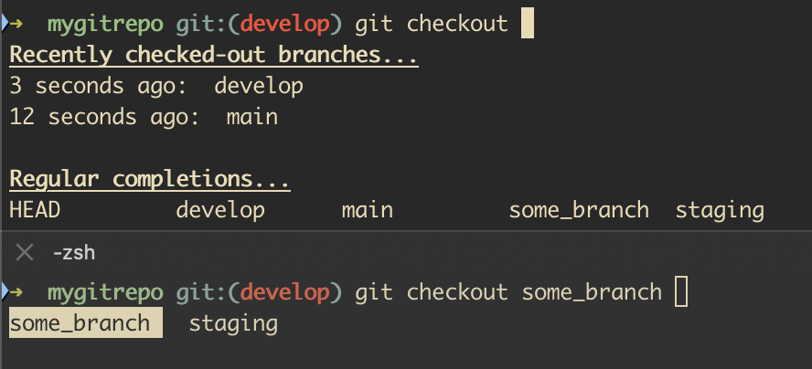

# Better git checkout autocompleter

Autocompletion plugin for ZSH that will complete `git checkout` with a list of recently checked-out branches.  
Inspired by the 'git lb' alias from https://ses4j.github.io/2020/04/01/git-alias-recent-branches/.

## Purpose

This plugin enhances the `git checkout` command by providing autocompletion for recently checked-out branches. It helps you quickly switch between branches you have recently worked on.

## Usage

When you type `git checkout` and press `<TAB>`, the plugin will provide a list of recently checked-out branches.  
If you specify any non-default arguments or start typing a branch name, the original git completion will be used.

## Preview



*The top section shows the plugin in action when pressing `<TAB>`.  
The bottom section shows the regular completion when pressing `s` then `<TAB>`.*

## Tuning

You can adjust the number of recently checked-out branches displayed by setting the `_GIT_COMPLETION_LAST_BRANCHES_COUNT` variable in your `.zshrc` file. The default value is 10.

```sh
_GIT_COMPLETION_LAST_BRANCHES_COUNT=15
```

## Installation

### oh-my-zsh

1. Clone the repository into your custom plugins directory:
    ```sh
    git clone https://github.com/lipner/better_git_checkout.git ${ZSH_CUSTOM:-~/.oh-my-zsh/custom}/plugins/better_git_checkout
    ```

2. Add the plugin to your `.zshrc` file:
    ```sh
    plugins=(... better_git_checkout)
    ```

3. Reload your `.zshrc` file:
    ```sh
    source ~/.zshrc
    ```

### Plain zsh

1. Clone the repository into a directory of your choice:
    ```sh
    git clone https://github.com/lipner/better_git_checkout.git ~/better_git_checkout
    ```

2. Source the plugin in your `.zshrc` file:
    ```sh
    source ~/better_git_checkout/better_git_checkout.plugin.zsh
    ```

3. Reload your `.zshrc` file:
    ```sh
    source ~/.zshrc
    ```
